# Trip Planning Concierge — Microsoft Agent Framework Demo

A C#/.NET demo of the four built-in multi-agent orchestration patterns in the **Microsoft Agent
Framework SDK** — Sequential, Concurrent, GroupChat, and Handoff — wired around one coherent
travel-planning scenario, with a live Blazor UI that shows which agent is talking and which tool
it's calling in real time. The Handoff flagship is deployed live to **Azure AI Foundry** as a
Foundry Hosted Agent.

## Architecture Overview

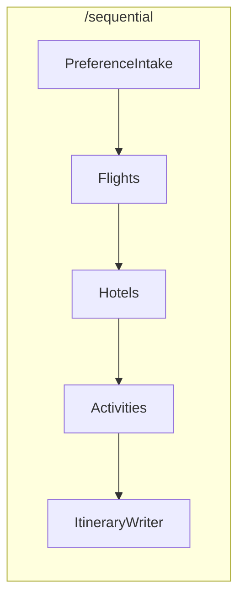

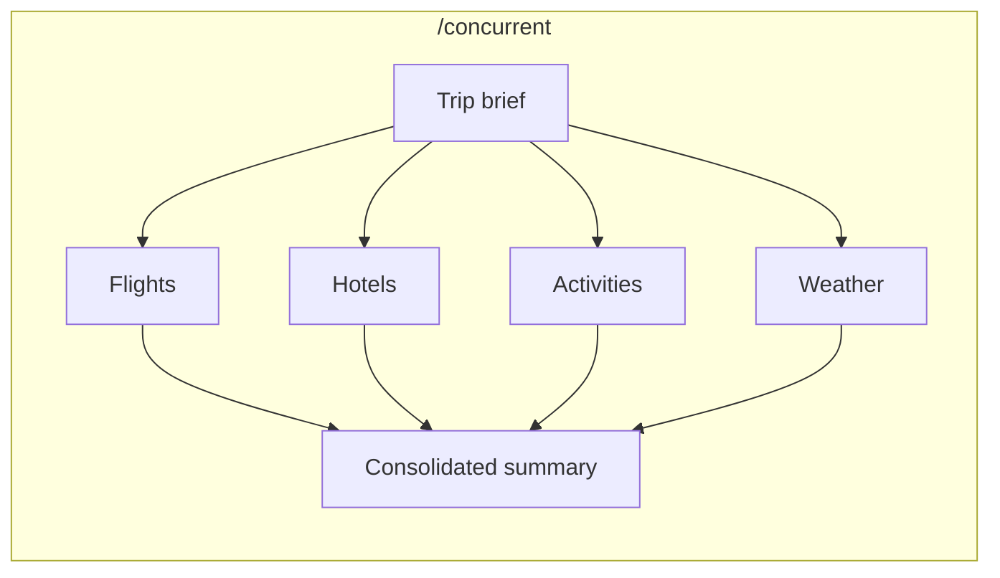

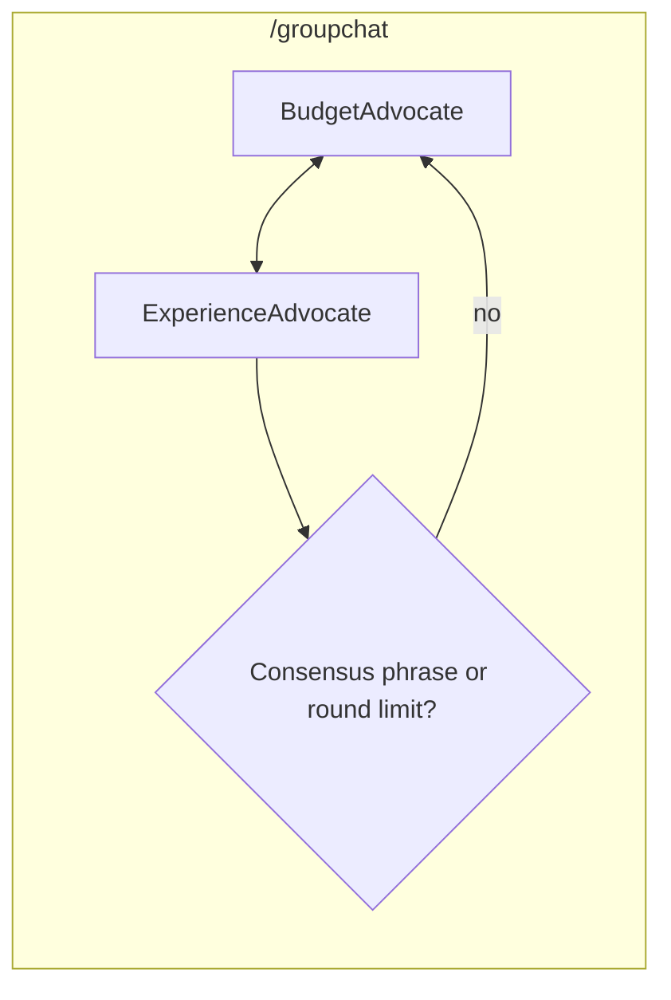

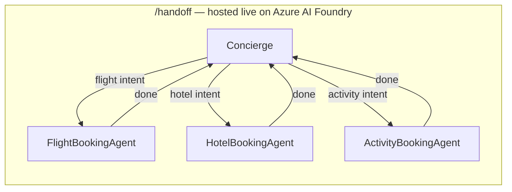

## Features

### Multi-Pattern Orchestration Showcase

One narrative across all four pages: plan a trip end-to-end (Sequential) → research it from
multiple angles in parallel (Concurrent) → watch two advisors debate trade-offs on the draft
itinerary (GroupChat) → chat with a concierge bot that hands off to booking specialists (Handoff).

| Pattern | Page | Agents | Builder API |
|---|---|---|---|
| Sequential | `/sequential` | PreferenceIntake → Flights → Hotels → Activities → ItineraryWriter | `AgentWorkflowBuilder.BuildSequential(...)` |
| Concurrent | `/concurrent` | Flights, Hotels, Activities, Weather run in parallel | `AgentWorkflowBuilder.BuildConcurrent(...)` |
| GroupChat | `/groupchat` | BudgetAdvocate vs ExperienceAdvocate | `AgentWorkflowBuilder.CreateGroupChatBuilderWith(...)` + custom `ConsensusGroupChatManager` |
| Handoff | `/handoff` | Concierge ⇄ FlightBooking / HotelBooking / ActivityBooking | `AgentWorkflowBuilder.CreateHandoffBuilderWith(...).WithHandoffs(...)` — **hosted live on Azure AI Foundry** |

### Live Activity Feed

Every page streams a real-time feed translated from the workflow's raw events: which agent is
currently speaking (`AgentResponseUpdateEvent.ExecutorId`), which tool it's calling and with what
arguments (`FunctionCallContent`/`FunctionResultContent`), handoff transitions between agents, and
human-in-the-loop approval prompts (`RequestInfoEvent` / `ToolApprovalRequestContent`) rendered as
inline Approve/Reject buttons that resume the paused workflow.

### Realistic Data, Not Fully Synthetic

| Need | Source | Notes |
|---|---|---|
| 🌦️ Weather | [Open-Meteo](https://open-meteo.com) | Free, no API key |
| 🏨 Hotels | OpenStreetMap Overpass API | Real venue names/locations, no API key; price/rating simulated (deterministically, by venue name) since OSM doesn't track pricing |
| 🎟️ Activities | OpenStreetMap Overpass API | Same as Hotels |
| ✈️ Flights | Azure AI Foundry's built-in `HostedWebSearchTool` | Genuine live web search; no separate Bing resource to provision (small per-call billing) |
| 🧾 Bookings | Simulated | No real payment/reservation; gated behind `ApprovalRequiredAIFunction` human-in-the-loop approval |

### Human-in-the-Loop

The three booking tools (`BookFlight`, `BookHotel`, `BookActivity`) are wrapped in
`ApprovalRequiredAIFunction`. On the `/handoff` page, a booking attempt pauses the workflow and
surfaces an inline Approve/Reject prompt — nothing executes until a human responds.

## Technology Stack

- **Microsoft Agent Framework** — `Microsoft.Agents.AI`, `Microsoft.Agents.AI.Workflows`, `Microsoft.Agents.AI.Foundry`, `Microsoft.Agents.AI.Foundry.Hosting`
- **Azure AI Foundry** — `Azure.AI.Projects`, `Azure.Identity` (`DefaultAzureCredential`, no API keys stored)
- **Blazor Server** (.NET 10) — real-time UI updates via SignalR, no custom streaming protocol
- **DotNetEnv** — loads `.env` locally; real environment variables are used as-is in hosted/CI environments

## Project Structure

```
AgenticAI-Trip-Concierge-MicrosoftAgentFramework/
├── TripConcierge.sln
├── global.json                          # pins the .NET 10 SDK
├── azure.yaml                           # azd manifest for the hosted agent
├── infra/                               # azd-provisioned Azure resources
├── src/
│   ├── TripConcierge.Shared/            # agents, tools, models, config - shared by everything
│   │   ├── Agents/TripAgentFactory.cs           # one factory method per persona
│   │   ├── Agents/ConsensusGroupChatManager.cs  # custom GroupChat termination logic
│   │   ├── ChatClients/FoundryChatClientFactory.cs
│   │   ├── Tools/                               # WeatherTool, OverpassPoiTool, BookingTools
│   │   ├── Models/                              # PointOfInterest, WeatherSummary, BookingResult
│   │   └── Prompts/AgentPrompts.cs
│   ├── TripConcierge.Web/                # Blazor Server app - the demonstrable surface
│   │   ├── Components/Pages/                    # Home, Sequential, Concurrent, GroupChat, Handoff
│   │   ├── Components/ActivityFeedView.razor     # live agent/tool activity feed
│   │   ├── Services/                            # *Runner classes wrap each workflow's run loop
│   │   └── Services/FoundryHostedAgentClient.cs # calls the deployed hosted agent for the live toggle
│   └── TripConcierge.HostedConcierge/    # headless backend - the agent actually deployed to Foundry
│       └── Program.cs
└── tests/
    └── TripConcierge.Shared.Tests/       # tool functions, weather/POI parsing, consensus logic
```

## Setup Instructions

### 1. Prerequisites

- [.NET 10 SDK](https://dotnet.microsoft.com/download/dotnet/10.0)
- [Azure CLI](https://learn.microsoft.com/cli/azure/install-azure-cli) and [Azure Developer CLI (azd)](https://learn.microsoft.com/azure/developer/azure-developer-cli/install-azd)
- An Azure subscription with access to Microsoft Foundry

### 2. Environment Configuration

```bash
cp .env.example .env
```

Fill in your Foundry project endpoint once provisioned (see "Azure Deployment" below). Authentication
uses `DefaultAzureCredential` — run `az login` locally; no API keys are stored anywhere in this repo.

### 3. Restore and Build

```bash
dotnet restore
dotnet build
```

## Environment Variables

| Variable | Description | Default |
|---|---|---|
| `FOUNDRY_PROJECT_ENDPOINT` | Azure AI Foundry project endpoint | Required |
| `AZURE_AI_MODEL_DEPLOYMENT_NAME` | Model deployment name | `gpt-5-mini` |
| `APPLICATIONINSIGHTS_CONNECTION_STRING` | App Insights connection string | Auto-injected when hosted |
| `HOSTED_CONCIERGE_ENDPOINT` | Deployed hosted agent's base URL (enables the `/handoff` page's live-agent toggle) | Optional |

## Usage

```bash
dotnet run --project src/TripConcierge.Web
```

Then open the printed `localhost` URL and try each page:

1. **`/sequential`** — describe a trip and watch the pipeline plan it stage by stage.
2. **`/concurrent`** — describe a trip and watch four agents research it in parallel.
3. **`/groupchat`** — submit a draft itinerary and watch the Budget/Experience debate play out.
4. **`/handoff`** — chat with the concierge; ask about flights, hotels, or activities and watch it
   hand off to the right specialist. Try a booking request to see the approval prompt.

## Screenshots

### Sequential

**1. Trip brief submitted — PreferenceIntakeAgent structures the request**
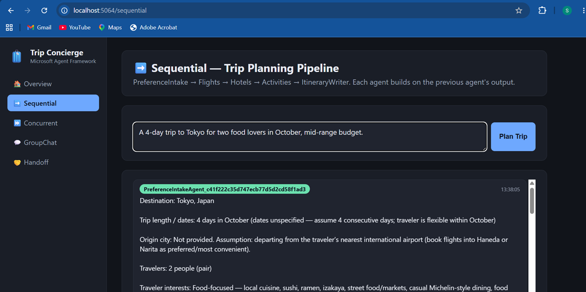

**2. Activity feed — pipeline routing through Flights → Hotels → Activities → ItineraryWriter**
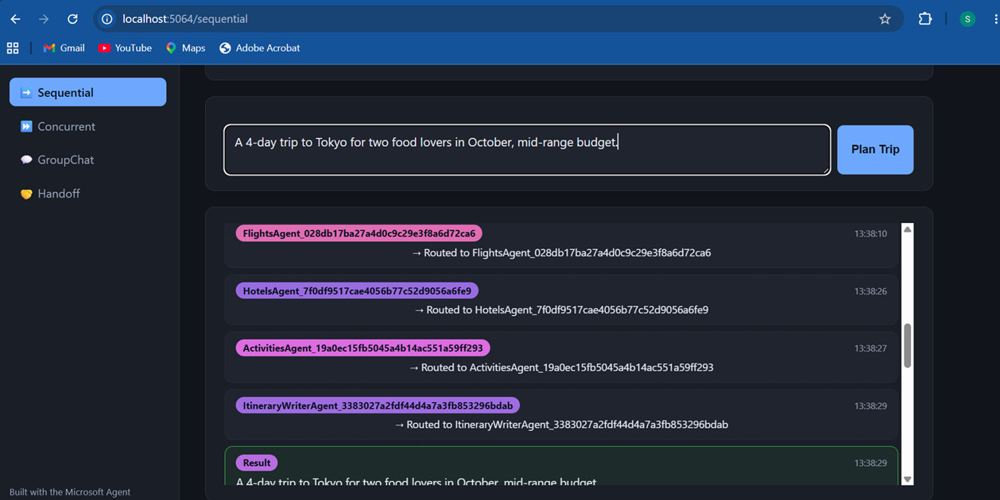

**3. Final itinerary — real food-focused recommendations for the Tokyo trip**
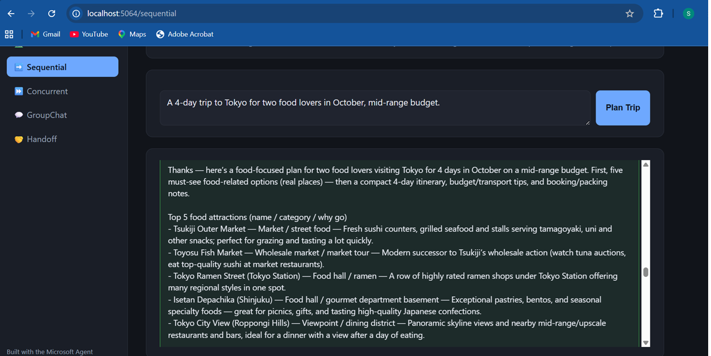

### Concurrent

**1. Trip brief submitted — Activities, Hotels, and Flights agents all routed to in parallel**
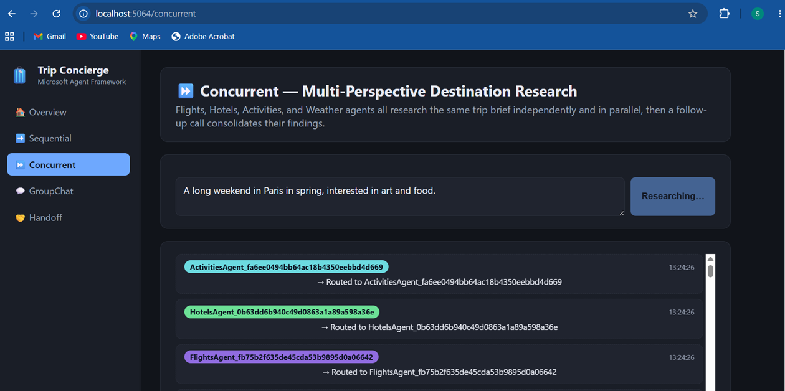

**2. ActivitiesAgent tool result — real OpenStreetMap venues for Paris (Musée de l'Armée, etc.)**
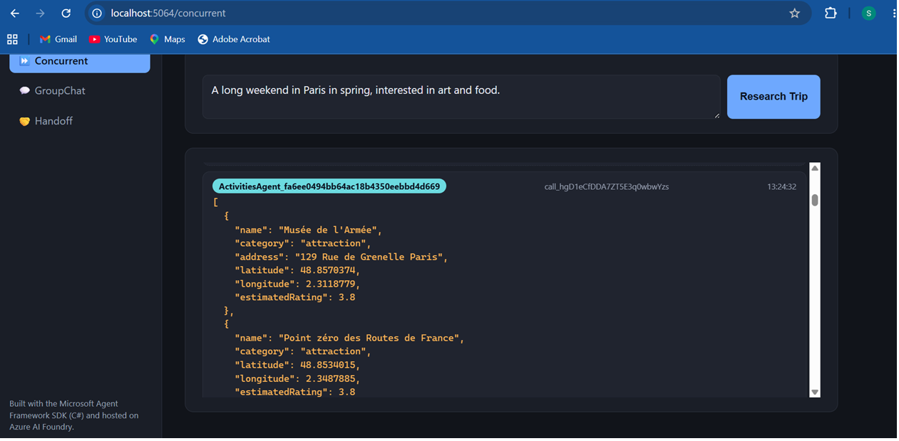

**3. HotelsAgent tool result — real OpenStreetMap hotels (Ibis, Hôtel Saint-Honoré)**
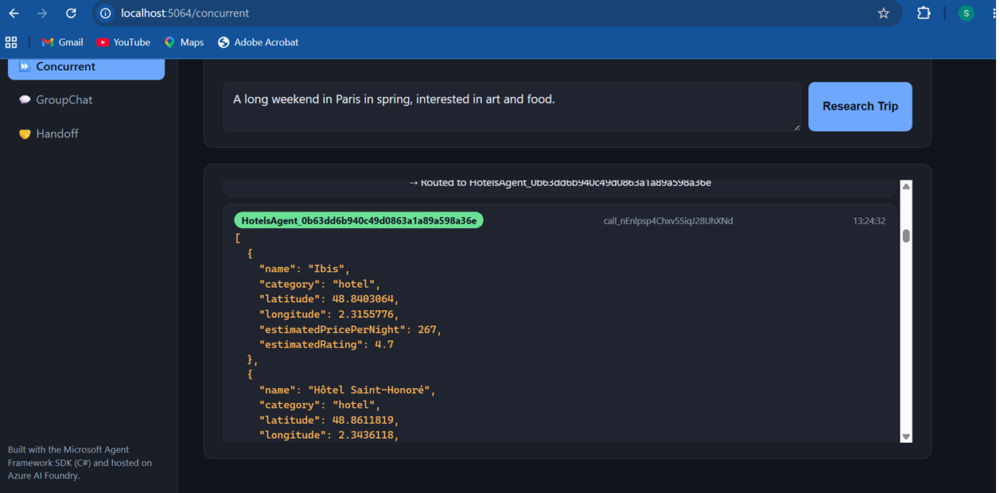

**4. Consolidated summary — follow-up call merges all four agents' parallel research**
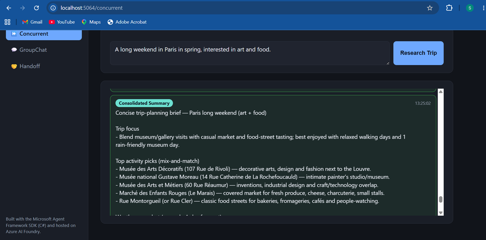

### GroupChat

**1. Draft itinerary submitted — BudgetAdvocate opens the debate**
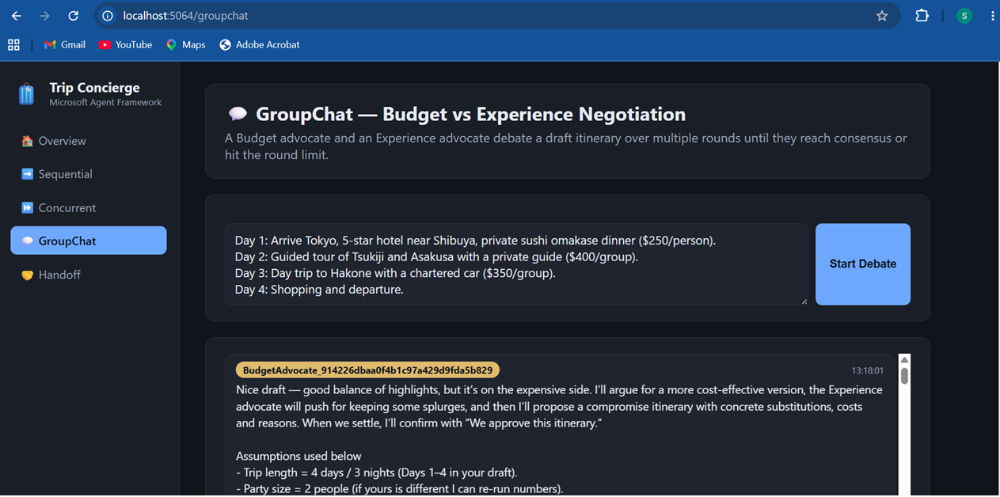

**2. ExperienceAdvocate's rebuttal — defending the splurges worth keeping**
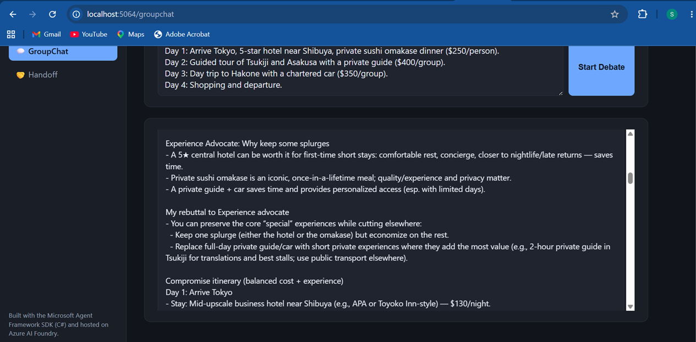

**3. Final negotiated itinerary — debate ends with "We approve this itinerary"**
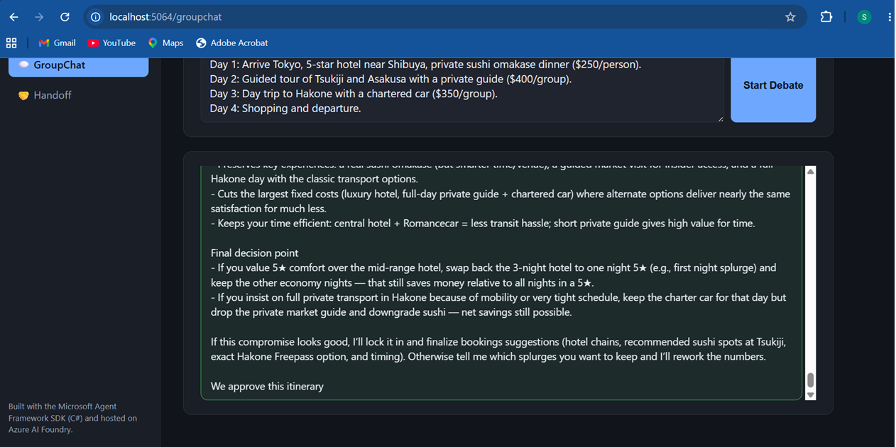

### Handoff — Local (in-process)

**1. Chat with the Concierge — collecting flight requirements (Delhi → Tokyo)**
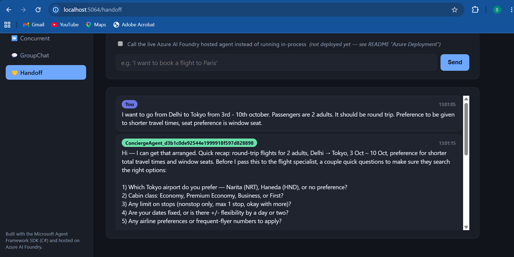

**2. Concierge initiates the handoff to the flight specialist, with full reasoning**
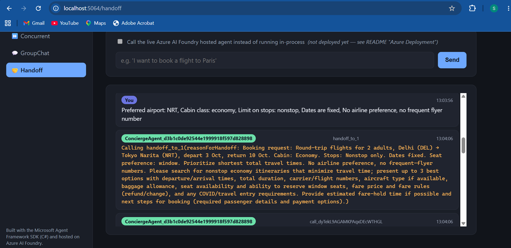

**3. Control transferred — FlightBookingAgent picks up the conversation with a recap**
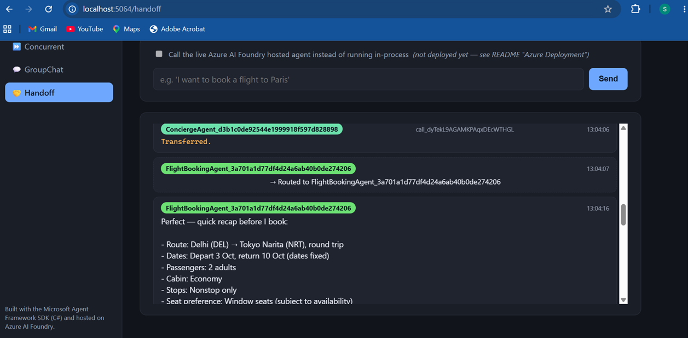

### Handoff — Live on Azure AI Foundry

**1. "Call the live Azure AI Foundry hosted agent" toggle enabled — chatting with the deployed agent**
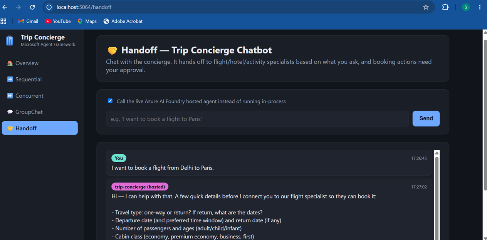

**2. The deployed `trip-concierge` hosted agent, visible in the Azure AI Foundry portal**
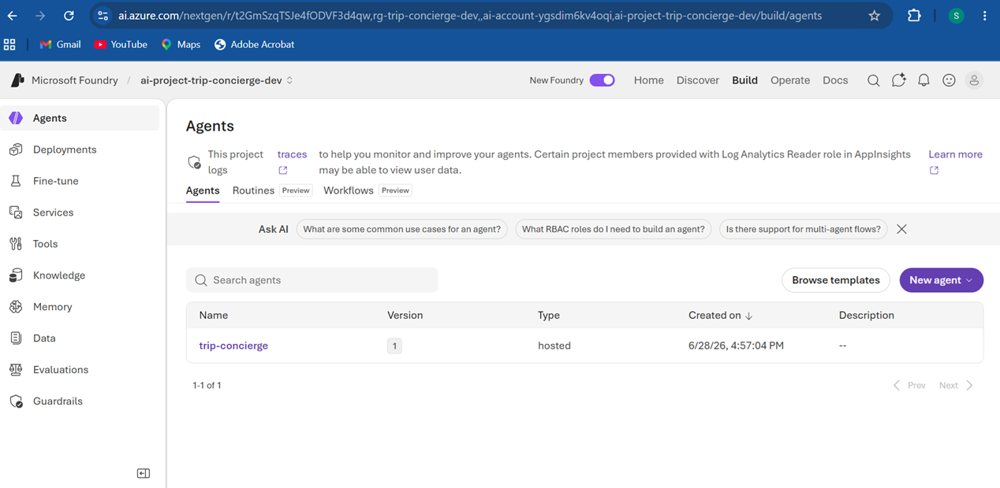

## Azure Deployment (Hosted Flagship)

Only the Handoff agent is deployed live, to keep Azure cost/complexity to a single flagship. The
other three pages still call models hosted in the same Foundry project — they just aren't deployed
as a separate Foundry *hosted agent* themselves.

**Local-vs-hosted architecture note:** the `/handoff` page's in-process run uses the real
multi-agent `Workflow` (`AgentWorkflowBuilder.CreateHandoffBuilderWith(...)`). The same `Workflow`
object is wrapped via `Workflow.AsAIAgent(...)` and deployed as the hosted agent in
`TripConcierge.HostedConcierge` — so the deployed agent is the same multi-agent handoff workflow,
not a single-agent simplification.

```bash
# 1. One-time tooling
azd ext install azure.ai.agents
az login
# Docker Desktop must also be installed and running (see "Recurring Deployment" below for why)

# 2. Provision (creates a resource group, Foundry project + model deployment, App Insights, ACR)
azd provision
```

### Recurring Deployment

Don't use plain `azd deploy` for this project — on this setup it fails two different ways:
remote ACR Tasks builds are blocked on the subscription (`TasksOperationsNotAllowed`), and azd's
own local-Docker fallback build has a bug that fails even when a plain `docker build` of the same
Dockerfile succeeds. 

**[`Deploy-HostedAgent.ps1`](Deploy-HostedAgent.ps1)** works around both by
building and pushing the image itself, then calling `azd deploy --from-package <image>` to deploy
that already-built image directly — skipping azd's broken build path entirely.

```powershell
.\Deploy-HostedAgent.ps1
```

Run this every time you change `TripConcierge.HostedConcierge` or `TripConcierge.Shared` and want
to redeploy. It:
1. Reads the Container Registry endpoint from the `azd` environment (so `azd provision` must have run at least once)
2. Looks up existing image tags in ACR and picks the next `vN` (so version numbers are always correct, even from a fresh machine)
3. Builds and tags the image as both `vN` and `latest`, retrying build/push automatically (Docker Desktop's network has been intermittently flaky in this environment)
4. Pushes to ACR, then runs `azd deploy --from-package <acr>/trip-concierge:vN`
5. Prints the current agent status (`azd ai agent show`)

**Two independent version numbers, both auto-incrementing — neither needs manual bookkeeping:**
- The **Docker image tag** (`v1`, `v2`, ...) — controlled by this script, based on what's already in ACR.
- The **Foundry agent version** — Foundry versions agents by name automatically: redeploying under
  the same agent name (`trip-concierge`, set in `agent.yaml`) creates a new version of that agent
  rather than a separate one. This happens server-side on every `azd deploy`/`--from-package`
  call, visible as `agent_reference.version` in API responses or via `azd ai agent show`.

Test the deployed endpoint directly (note the URL `azd`/the script prints is already the complete,
ready-to-POST endpoint — including the protocol path and `api-version` query string — so nothing
needs to be appended to it):

```powershell
$token = (az account get-access-token --resource "https://ai.azure.com" --query accessToken -o tsv)
$body = @{ input = "I want to book a flight to Tokyo" } | ConvertTo-Json
Invoke-RestMethod -Uri $env:HOSTED_CONCIERGE_ENDPOINT -Method Post -Headers @{ Authorization = "Bearer $token" } -ContentType "application/json" -Body $body
```

Set `HOSTED_CONCIERGE_ENDPOINT` in `.env` once, after the first deployment, to enable the
`/handoff` page's "Call the live Azure AI Foundry hosted agent" toggle — the URL stays the same
across versions (it points at the agent by name), so it doesn't need updating on later deploys.

**Cost control:** the model deployment uses a small/cheap model (`gpt-5-mini`) by default, and the
FlightsAgent's `HostedWebSearchTool` calls incur small, pay-per-call Bing Grounding billing. Run
`azd down` when you're not actively demoing to avoid idle compute costs.

## Testing

```bash
dotnet test
```

Covers tool-parsing logic (Open-Meteo forecast parsing, Overpass POI parsing, deterministic
price/rating simulation), booking confirmation shape, and the `ConsensusGroupChatManager`
termination logic — not LLM output itself, which is inherently non-deterministic and verified
manually by running each page.

## Known Limitations / Design Decisions

- **Synthetic pricing/ratings**: hotel and activity *names and locations* are real (OpenStreetMap);
  price and rating are simulated since OpenStreetMap doesn't track either.
- **Flights have no structured data model**: since no free, no-key flight pricing API exists, the
  FlightsAgent relies on live web search instead of a typed tool result.
- **Bookings are simulated**: no real payment or reservation is made anywhere in this demo.
- **Only the Handoff agent is hosted live**: the other three patterns are demoed locally only, to
  keep the Azure footprint to one flagship deployment.
