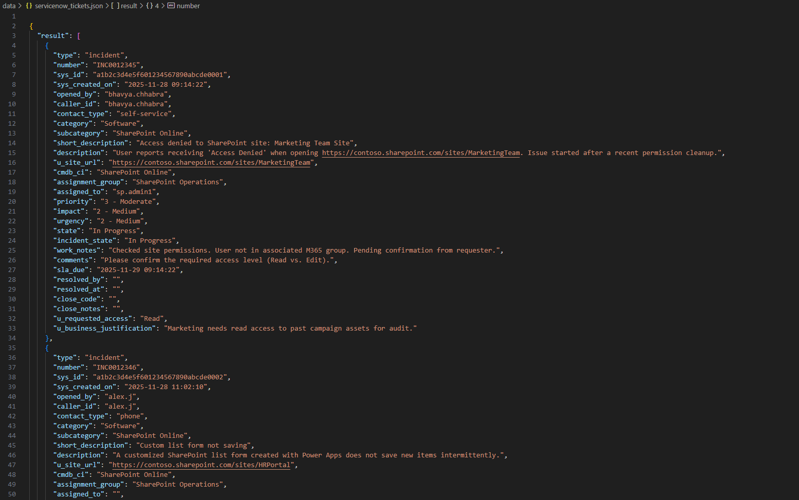
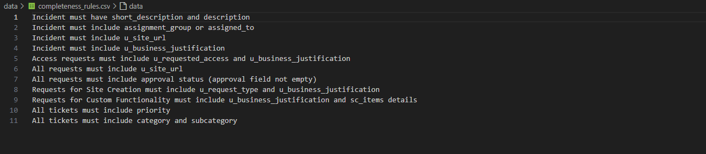
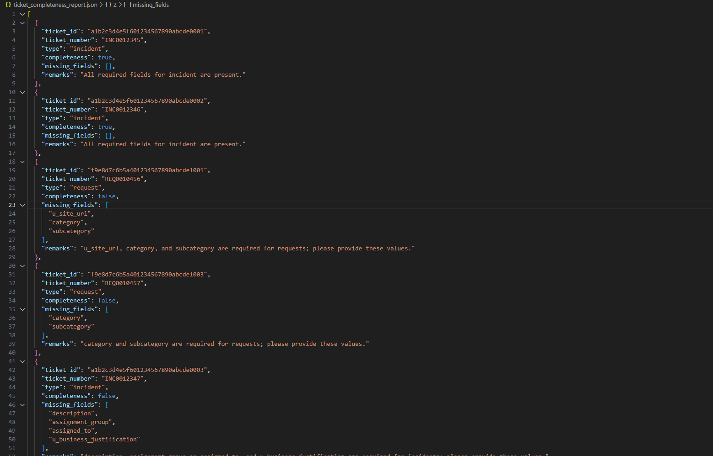
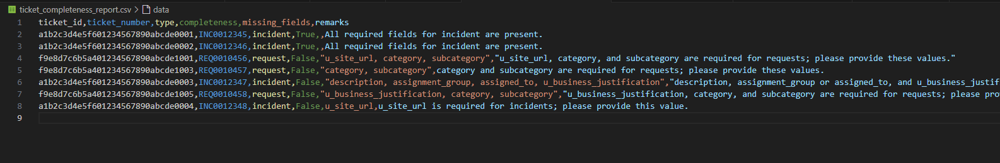
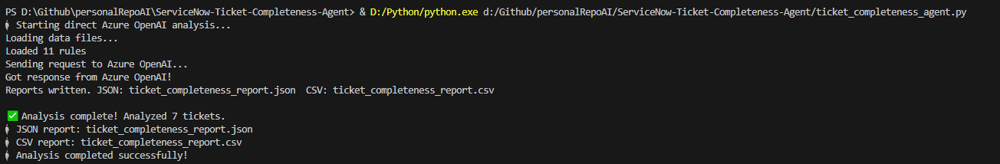

# ServiceNow Ticket Completeness Agent

This project provides an automated agent to analyze ServiceNow ticket dump (exported from service now in json format) for completeness, using a set of configurable rules and a compatible OpenAI API endpoint (such as Azure OpenAI or a custom proxy). It produces a report which clearly states the missing information in each ticket. This helps the support team to ask the users for the relevant information and saves the support team's time in triaging the tickets.

## How it Works

The agent takes two main inputs:
- **A ServiceNow ticket JSON file** (see below)
- **A rules CSV file** (see below)

It produces two outputs:
- **A JSON report** with completeness results
- **A CSV report** for spreadsheet use

Below are screenshots of the input and output files:

 ### Input Ticket JSON 

 

 ### Input Rules CSV


 ### Output JSON Report
 

 ### Output CSV Report


These images show the expected formats for the input and output files. The agent reads the ticket and rules files, analyzes each ticket for completeness, and writes the results to both JSON and CSV files.

## Features
- Reads ServiceNow ticket data from a JSON file
- Reads completeness rules from a CSV file (one rule per line)
- Uses an LLM (via OpenAI-compatible API) to:
  - Evaluate each ticket against the rules
  - Produce a structured list of results
- Writes both JSON and CSV reports to disk
- All API credentials and endpoints are loaded from environment variables (see `.env.example`)

## Usage

1. **Install dependencies**
   ```bash
   pip install -r requirements.txt
   ```

2. **Prepare your environment**
   - Copy `.env.example` to `.env` and fill in your actual API key, endpoint, and version.
   - Place your ServiceNow ticket JSON and rules CSV in the `data/` directory (see below for format).

3. **Run the agent**
   ```bash
   python ticket_completeness_agent.py
   ```
   

4. **Output**
   - `ticket_completeness_report.json`: JSON report of ticket completeness
   - `ticket_completeness_report.csv`: CSV report for spreadsheet use

## Data File Formats

- **Ticket JSON**: Should be a ServiceNow export, e.g.
  ```json
  { "result": [ { ...ticket fields... }, ... ] }
  ```
- **Rules CSV**: One rule per line, first column only.

## Environment Variables

All sensitive and endpoint details are loaded from a `.env` file. See `.env.example` for the required variables:
- `AZURE_OPENAI_API_KEY`: Your API key for the OpenAI-compatible endpoint
- `AZURE_OPENAI_API_VERSION`: API version (e.g., `2024-12-01-preview`)
- `AZURE_OPENAI_URL`: Full endpoint URL for chat completions (e.g., `https://.../chat/completions`)
- `AZURE_OPENAI_MODEL`: Model (LLM) used for chat completions (e.g., `gpt-4.1`)

## Security
- **Never commit your real `.env` file or API keys to public repositories.**
- Only commit `.env.example` as a template.

## License
MIT or your preferred open source license.

---

**This project is designed for easy adaptation to any OpenAI-compatible API endpoint.**
