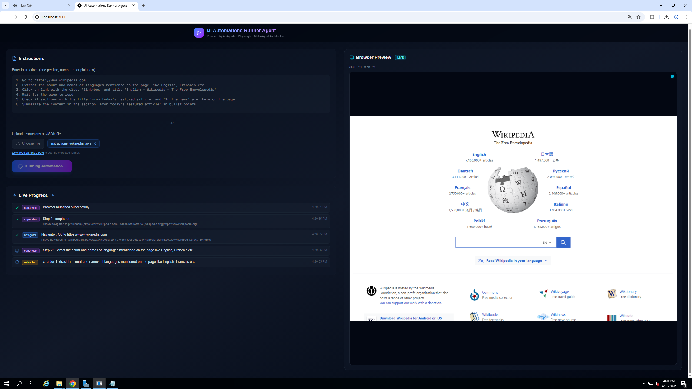
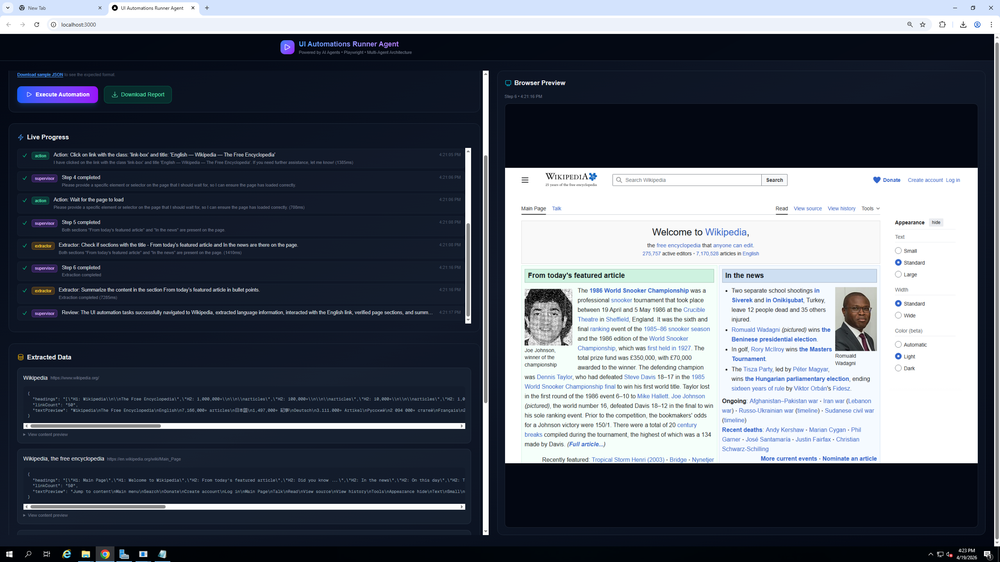
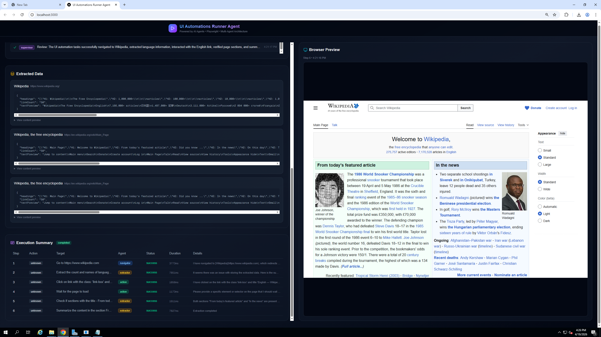
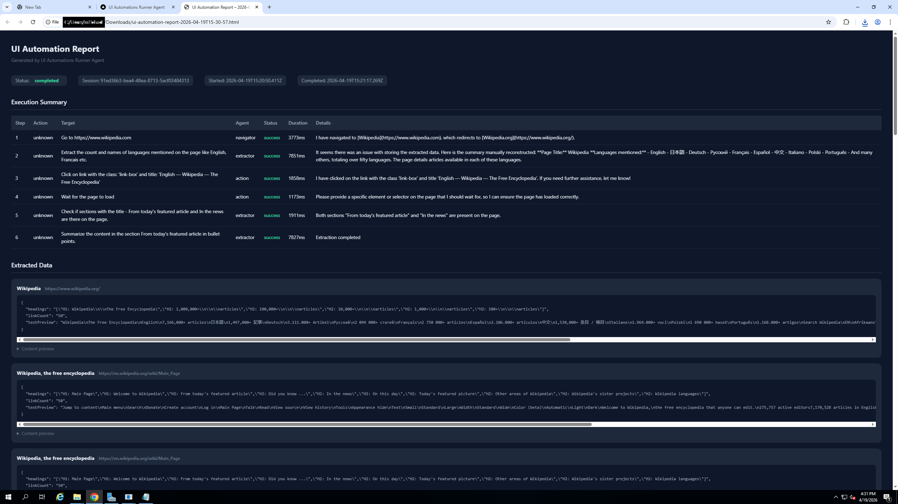
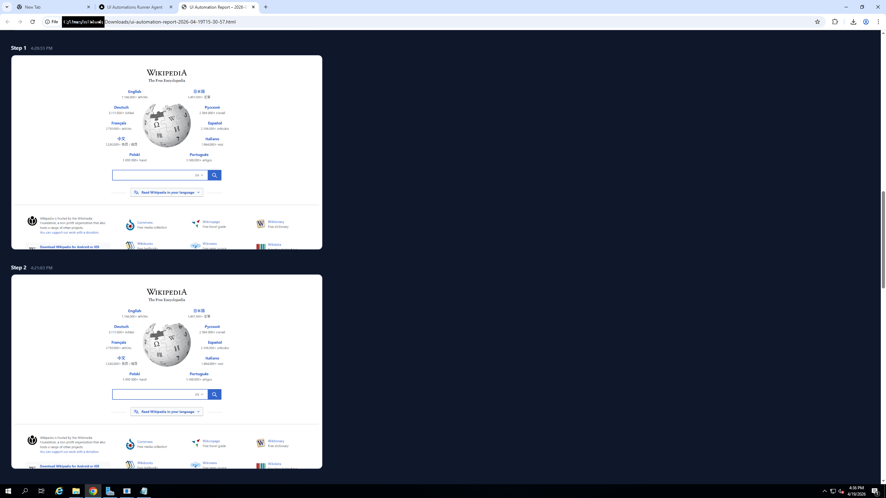
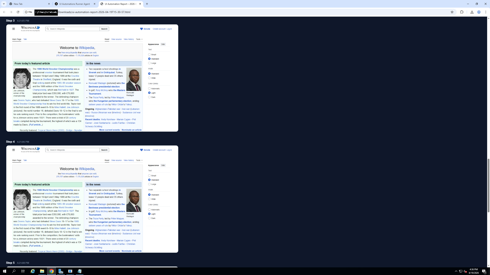

# Agentic UI Automation Runner

**Automate any browser task using plain English instructions.** Simply describe what you want done — navigate to a website, click buttons, fill forms, extract data — and this app will execute each step in a real browser, show you live progress, and produce a visual report with screenshots of every action taken.

### How it works

1. **You describe the steps** — Type instructions in plain English or upload a JSON file with structured steps.
2. **AI agents execute in a real browser** — Behind the scenes, a team of specialized AI agents drives a Chromium browser (via Playwright) on the server. A supervisor agent reads your instructions, delegates each step to the right specialist (navigation, data extraction, or UI interaction), and monitors progress.
3. **You see it happen live** — As each step executes, you see real-time progress updates and a live screenshot preview of what the browser is doing.
4. **You get a full report** — Once complete, download a self-contained HTML report with an execution summary table and embedded screenshots for every step — no external storage needed.

### Technical foundation

Built with Next.js, Vercel AI SDK v6 (multi-agent orchestration), Playwright (headless Chromium), and Tailwind CSS. Supports both OpenAI and Azure OpenAI as the LLM provider.

## Features

- **Natural language instructions** — Enter automation steps as plain text
- **JSON file upload** — Upload structured instruction sets with multiple use cases
- **Multi-agent architecture** — Supervisor, Navigator, Extractor, and Action agents
- **Live progress streaming** — Real-time SSE updates as agents execute
- **Browser preview** — Live screenshots after each step
- **Structured data extraction** — Extract content and field values
- **HTML report download** — Self-contained report with summary table and embedded screenshots
- **Password masking** — Sensitive values are masked in progress logs and reports
- **Execution summary** — Table view of all actions taken with status and timing

## Screenshots

### Entering/uploading the instructions and running the UI automation in browser







### Generated report with summary and screenshots of the pages browsed







## Architecture

```
┌──────────────────────────────────────┐
│           Supervisor Agent           │
│   (Orchestrates & reviews progress)  │
└────┬────────────┬───────────┬────────┘
     │            │           │
┌────▼────┐ ┌────▼─────┐ ┌──▼───────┐
│Navigator│ │Extractor │ │  Action  │
│  Agent  │ │  Agent   │ │  Agent   │
└────┬────┘ └────┬─────┘ └──┬───────┘
     │            │           │
     └────────────┼───────────┘
                  │
          ┌───────▼────────┐
          │   Playwright   │
          │   (Chromium)   │
          └────────────────┘
```

## Getting Started

### Prerequisites

- Node.js 18+
- An OpenAI API key (or Azure OpenAI endpoint)

### Installation

```bash
npm install
npx playwright install chromium
```

### Configuration

Copy the example environment file and fill in your keys:

```bash
cp .env.example .env
```

Then edit `.env` with your values:

```env
# Provider: set to "azure" for Azure OpenAI, or omit/leave empty for standard OpenAI
OPENAI_PROVIDER=

# Standard OpenAI settings
OPENAI_API_KEY=your-openai-api-key-here    # Your OpenAI API key
OPENAI_MODEL=gpt-4o                         # Model to use (e.g. gpt-4o, gpt-4-turbo)
# OPENAI_BASE_URL=https://api.openai.com/v1 # Optional: custom base URL

# Azure OpenAI settings (used when OPENAI_PROVIDER=azure)
# AZURE_API_KEY=your-azure-api-key-here      # Azure OpenAI API key
# AZURE_RESOURCE_URL=https://your-resource.openai.azure.com/openai  # Full resource URL
# AZURE_DEPLOYMENT=gpt-4o                    # Deployment name
# AZURE_API_VERSION=2024-10-21               # API version
```

| Variable | Required | Description |
|----------|----------|-------------|
| `OPENAI_PROVIDER` | No | Set to `azure` for Azure OpenAI. Leave empty for standard OpenAI. |
| `OPENAI_API_KEY` | Yes (standard) | Your OpenAI API key |
| `OPENAI_MODEL` | Yes | The model/deployment name to use |
| `OPENAI_BASE_URL` | No | Custom base URL (useful for proxies or gateways) |
| `AZURE_API_KEY` | Yes (azure) | Azure OpenAI API key |
| `AZURE_RESOURCE_URL` | Yes (azure) | Full Azure OpenAI resource URL including `/openai` path |
| `AZURE_DEPLOYMENT` | Yes (azure) | Azure deployment name |
| `AZURE_API_VERSION` | Yes (azure) | Azure API version (e.g. `2024-10-21`) |

### Development

```bash
npm run dev
```

Open [http://localhost:3000](http://localhost:3000).

### Build

```bash
npm run build
npm start
```

## Usage

### Text Instructions

Enter instructions line by line:

```
1. Go to https://www.wikipedia.com
2. Extract the count and names of languages mentioned on the page
3. Click on link with the text English
4. Wait for the page to load
5. Check if sections with the title - From today's featured article and In the news are there on the page
6. Summarize the content in the section From today's featured article in bullet points
```

### OR

### JSON File Upload

Upload a JSON file with the `use_cases` format. Each use case has an `id`, optional `name`, and an array of `steps`:

```json
{
  "use_cases": [
    {
      "id": "wikipedia-homepage",
      "name": "Wikipedia Homepage Exploration",
      "steps": [
        {
          "step": 1,
          "description": "Go to https://www.wikipedia.com"
        },
        {
          "step": 2,
          "description": "Extract the count and names of languages mentioned on the page like English, Francais etc."
        },
        {
          "step": 3,
          "description": "Click on link with the class: 'link-box' and title: 'English — Wikipedia — The Free Encyclopedia'"
        },
        {
          "step": 4,
          "description": "Wait for the page to load"
        },
        {
          "step": 5,
          "description": "Check if sections with the title - From today's featured article and In the news are there on the page."
        },
        {
          "step": 6,
          "description": "Summarize the content in the section From today's featured article in bullet points."
        }
      ]
    }
  ]
}
```

A sample file (`instructions_wikipedia.json`) is available for download from the app UI.

## Azure Deployment

This app is designed for deployment as an Azure Web App:

1. Create an Azure Web App (Node.js 18+ runtime)
2. Set environment variables in App Settings (see Configuration above)
3. Deploy using Azure CLI, GitHub Actions, or VS Code Azure extension
4. Ensure Playwright browsers are installed (add `npx playwright install chromium --with-deps` to startup script)

## PowerShell + Playwright MCP companion agent

The repo also includes a fully standalone PowerShell-based agent under
[`powershell-playwright-mcp-agent/`](powershell-playwright-mcp-agent/). It is independent of the Next.js web app and is
useful when you want to run the same kind of UI automation locally from a script — no server, no UI — driven entirely
by a CSV file of test steps.

### What it does

- Reads test steps from one or more CSV files (columns: `Use Case ID`, `Use Case Name`, `Use Case Description`, `Step ID`, `Step Description`).
- Starts [`@playwright/mcp`](https://github.com/microsoft/playwright-mcp) as a stdio subprocess.
- Calls OpenAI / Azure OpenAI `chat/completions` and routes the model's tool calls to the Playwright MCP server.
- Captures a screenshot after every browser action and writes a self-contained HTML report under `powershell-playwright-mcp-agent/Reports/run-<timestamp>/`.

### Quick start

```powershell
cd powershell-playwright-mcp-agent

# Create your local config from the checked-in template (agent-config.psd1 is git-ignored)
Copy-Item .\agent-config.example.psd1 .\agent-config.psd1

# Edit agent-config.psd1 and set ApiKey (or leave empty to use the OPENAI_API_KEY env var)
notepad .\agent-config.psd1

# Run with the bundled example instructions
.\Invoke-PlaywrightMcpAgent.ps1 -InstructionsFolder .\InstructionFiles
```

Or just double-click `run-agent.bat`. Node.js, `@playwright/test`, and the configured browser binaries are
auto-installed on first run.

See [`powershell-playwright-mcp-agent/README.md`](powershell-playwright-mcp-agent/README.md) for the full CSV format,
configuration reference, and troubleshooting notes.

## Tech Stack

- **Next.js 16** — React framework with App Router
- **Vercel AI SDK v6** — Multi-agent orchestration
- **Playwright** — Browser automation (headless Chromium)
- **Tailwind CSS** — Styling
- **TypeScript** — Type safety
- **OpenAI GPT-4o** — LLM for agent reasoning (supports Azure OpenAI)
