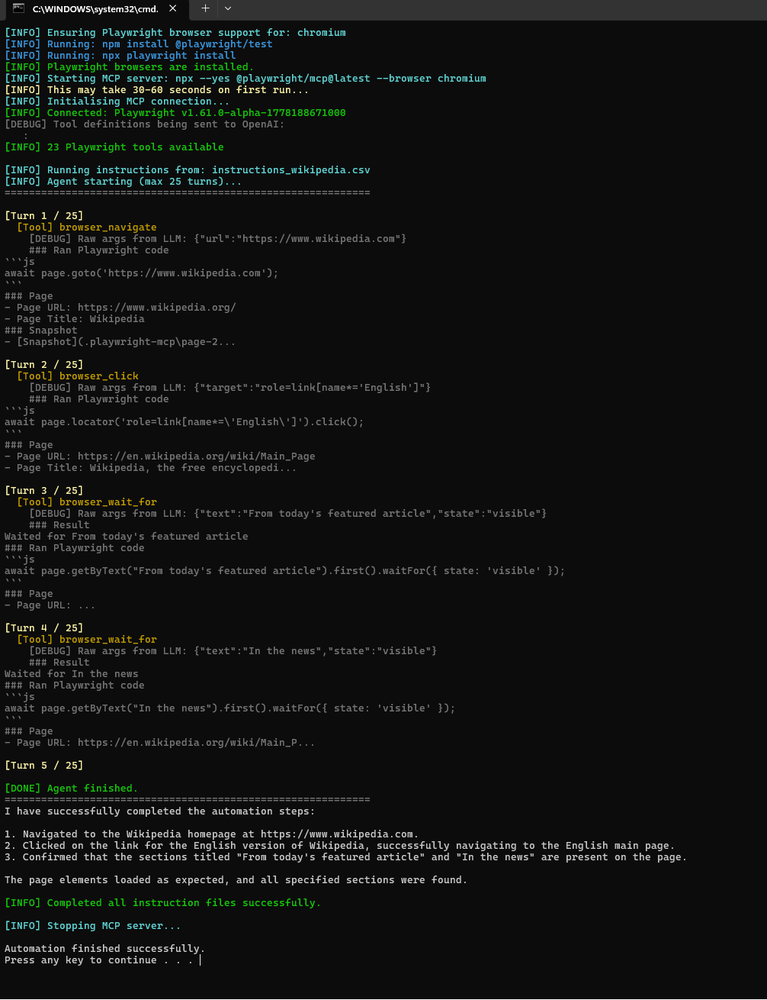
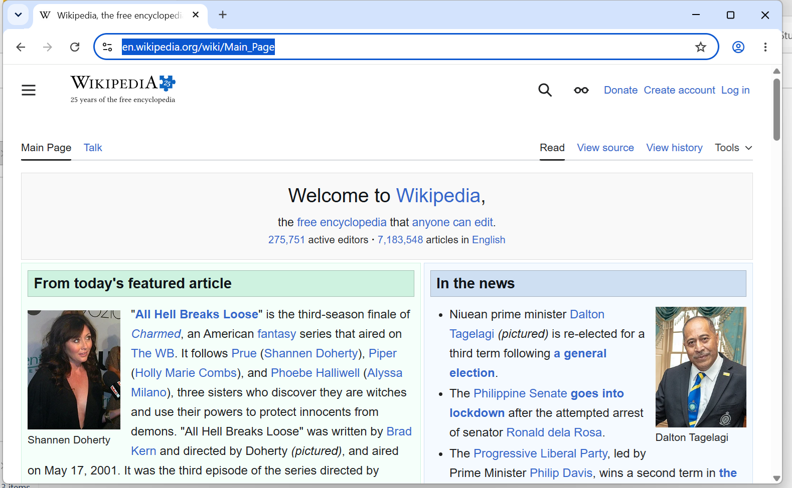
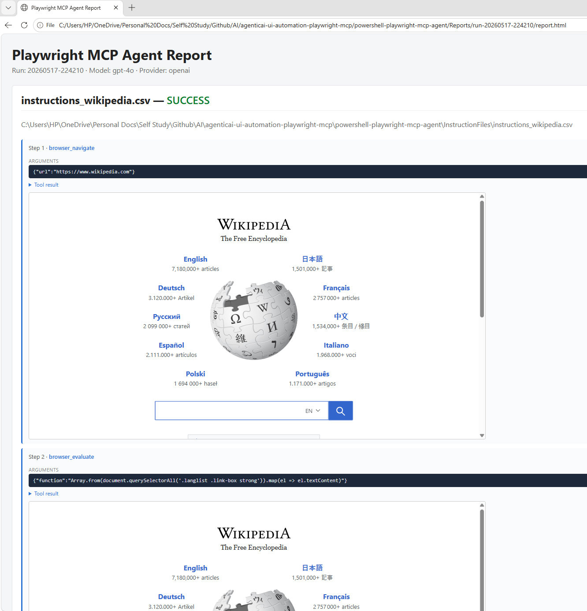

# PowerShell Playwright MCP Agent

Standalone folder, independent from the web app.

## What this does

Runs UI automation steps from CSV instructions, starts `@playwright/mcp` as a subprocess, and uses OpenAI-compatible `chat/completions` tool calling to execute steps in a real browser.

Input modes:

- Single-file mode: one CSV file
- Batch mode: all `.csv` files from an instructions folder, executed one by one

The browser is visible by default (`McpHeaded = $true` in `agent-config.psd1`).

## Current folder structure

| File | Purpose |
|---|---|
| `Invoke-PlaywrightMcpAgent.ps1` | Main runner script |
| `agent-config.example.psd1` | Template configuration (checked into git, no secrets) |
| `agent-config.psd1` | Your local runtime configuration (git-ignored, contains your API key) |
| `run-agent.bat` | Double-click launcher for non-technical users |

## Prerequisites

- Windows PowerShell 5.1+
- API key for OpenAI or Azure OpenAI-compatible endpoint

Node.js is auto-installed by the script if missing, using a silent per-user MSI install (no admin required in most environments).
Note: this still requires internet access and allows only where your IT policies permit MSI installs.

Playwright support is auto-installed by the script on first run using:

1. `npm install @playwright/test`
2. `npx playwright install`

The selected browser (from `McpBrowser` config, default `chromium`) will be downloaded and cached.

## One-time configuration

The real config file `agent-config.psd1` is git-ignored because it holds your API key.
Create it once from the checked-in template:

### PowerShell

```powershell
Copy-Item .\agent-config.example.psd1 .\agent-config.psd1
```

### Command Prompt

```cmd
copy agent-config.example.psd1 agent-config.psd1
```

### File Explorer

Right-click `agent-config.example.psd1` -> **Copy**, then **Paste**, then rename the copy to `agent-config.psd1`.

Then open `agent-config.psd1` in any text editor and fill in your values:

1. Set `Provider` to `openai` or `azure`.
2. Set `BaseUrl`:
   - OpenAI example: `https://api.openai.com/v1`
   - Azure example: `https://YOUR-RESOURCE.openai.azure.com/openai/deployments/YOUR-DEPLOYMENT`
3. Set `ApiKey` directly (replace `REPLACE_WITH_YOUR_API_KEY_OR_LEAVE_EMPTY_TO_USE_ENV_VAR`),
   or leave it empty to use env vars:
   - `openai` provider -> `OPENAI_API_KEY`
   - `azure` provider -> `AZURE_OPENAI_API_KEY`
4. Keep `Model = "gpt-4o"` (current default), or change if needed.

> **Never commit `agent-config.psd1`.** It is listed in the repo `.gitignore`. Only edit
> `agent-config.example.psd1` when you need to change defaults or add new keys for others.
## Running

### Option 1: double-click

```text
run-agent.bat
```

Default behavior:

- Reads all CSV files from `instruction files` folder if present
- Otherwise reads all CSV files from `InstructionFiles` folder
- Executes files in name-sorted order

If Node.js is not available on the machine, the script first installs Node LTS silently for the current user and then continues.

### Option 2: PowerShell

Batch mode using folder:

```powershell
.\Invoke-PlaywrightMcpAgent.ps1 -InstructionsFolder ".\InstructionFiles"
```

Single-file mode:

```powershell
.\Invoke-PlaywrightMcpAgent.ps1 -InstructionsPath ..\InstructionFiles\instructions_wikipedia.csv
```

Custom config path:

```powershell
.\Invoke-PlaywrightMcpAgent.ps1 -InstructionsPath my-steps.csv -ConfigPath my-config.psd1
```

If neither `-InstructionsPath` nor `-InstructionsFolder` is provided, the script auto-detects:

- `instruction files`
- `InstructionFiles`

next to the script file.

## What it looks like end-to-end

The agent goes through three visible phases on every run. The screenshots below are from a sample run against
`InstructionFiles/instructions_wikipedia.csv`.

### 1. Script run (PowerShell console)

The script logs each turn of the LLM loop, every MCP tool call with its arguments, and a short preview of each tool
response. This is where you confirm the agent is making progress and see any tool-call errors live.



### 2. Browser automation (Playwright MCP)

The Playwright MCP server drives a real Chromium window (visible by default via `McpHeaded = $true`). You can watch the
clicks, typing, and navigations happen in real time as the LLM issues tool calls.



### 3. HTML report (`Reports/run-<timestamp>/report.html`)

After the run finishes, a self-contained HTML report is written under `powershell-playwright-mcp-agent/Reports/`. It
lists every step in sequence with the tool name, the arguments the LLM sent, the (collapsible) tool result, the
assistant's narrative between steps, and an embedded screenshot of the browser captured right after each action.



## Accepted instruction CSV format

The CSV must include these columns:

- `Use Case ID`
- `Use Case Name`
- `Use Case Description`
- `Step ID`
- `Step Description`

Example:

```csv
Use Case ID,Use Case Name,Use Case Description,Step ID,Step Description
login-flow,Login Flow,Sign in to the application,1,Go to https://example.com
login-flow,Login Flow,Sign in to the application,2,Fill username and password
```

## How it works (high level)

1. Loads settings from `agent-config.psd1`.
2. Ensures Node.js is available (auto-installs if missing).
3. Installs/verifies Playwright support and browser binaries for the configured browser (`McpBrowser` setting).
4. Starts Playwright MCP server over stdio.
5. Discovers MCP tools (`tools/list`) and exposes them as function tools to `chat/completions`.
6. Loads one CSV file (or iterates through all CSV files in a folder).
7. Sends step list to the LLM.
8. Executes model tool calls with MCP (`tools/call`), returns tool outputs to the LLM.
9. Repeats until the model returns a final answer, then moves to the next file in batch mode.

**First run note:** Browser installation and MCP server startup may take 30-60 seconds on first run.

## Configuration reference (`agent-config.psd1`)

| Key | Default | Description |
|---|---|---|
| `Provider` | `openai` | `openai` or `azure` request mode |
| `ApiKey` | `""` | If empty, script falls back to provider-specific env var |
| `BaseUrl` | `https://api.openai.com/v1` | Base URL without trailing `/chat/completions` |
| `ApiVersion` | `2024-10-21` | Azure-only query parameter value |
| `Model` | `gpt-4o` | Model/deployment name |
| `MaxTurns` | `25` | Maximum LLM loop turns |
| `McpHeaded` | `$true` | Show browser window |
| `McpBrowser` | `chromium` | `chromium` (installs as `chrome-for-testing`), `firefox`, or `webkit` |
| `MaxToolContentChars` | `12000` | Per-tool-call output cap sent back to the LLM |

> The system prompt is defined in `Invoke-PlaywrightMcpAgent.ps1` and cannot be overridden from the config file.

## Exit behavior

- Exit code `0`: all processed instruction files completed successfully
- Exit code `1`: one or more files failed

## Troubleshooting

**Browser installation fails**: The script runs `npm install @playwright/test` followed by `npx playwright install` before starting the MCP server. If this fails:
- Ensure internet connectivity is available
- Check that `McpBrowser` in `agent-config.psd1` is set to a valid value (`chromium`, `firefox`, or `webkit`)
- Try running the install command manually in a terminal to see detailed error output

**CSV parsing issues**: Each row should represent one step and repeat the same use case metadata across that use case's rows. The script reads the `Step Description` column and passes that step text to the LLM/MCP loop.

**MCP server startup is slow**: First startup takes 30-60 seconds as the browser is initialized. Subsequent runs using the same browser are faster.

**Tool calls timeout**: Browser operations (navigation, clicking) may take longer on slower networks or with complex pages. The script uses a 5-minute timeout per tool call by default.
